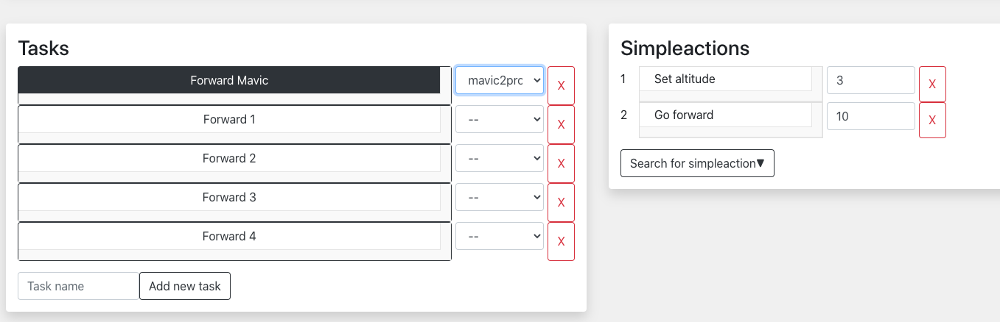

# Documentation for adding a new task allocation algorithm

One of the expandable features of Wirom2.0 is the possibility of adding custom task allocation algorithm.

## Structure
In the web interface, the user has to provide two things:
1. The name of the new algorithm (input *above* the editor)
2. The implementation of the new algorithm (input *in* the code editor)


## Running example
The running mission example used throughout this documentation guide is a **simple, unallocated go forward mission**. 
This misssion contains five tasks, named *"Forward x"*. Each of these tasks contains one simpleaction, *"go forward forward for 10 seconds"*, **except** the first task (let's call it *Forward Mavic*) which also contains *"set altitude"*. This means that *Forward Mavic* can only be performed by the **Mavic2Pro** drone, while the rest of the tasks can be performed by any of the robots. \
A screenshot from the web interface of the current mission:




## Parameter formats
There are two required parameters for the functions: 
- *Tasks*: A list of the tasks to be allocated
- *Robots*: A list of the robots


The *task* list is a list of Python Dictionary objects, and with the **go forward mission** in the running example the task format is: 
```python
[
    {
        "chosen": False,
        "id": 0,
        "name": "Forward Mavic"
        "robot": "mavic2pro",       # Value to be assigned
        "simpleactions": [
            {
                "args": "3",
                "chosen": False,
                "id": 0,
                "name": "set_altitude"
            },
            {
                "args": "10",
                "id": 1,
                "chosen": False,
                "name": "go_forward"
            }
        ]
    },
    {
        "chosen": False,
        "id": 1,
        "name": "Forward 1"
        "robot": "--",          # '--' means unassigned. This value is to be assigned
        'simpleactions': [
            {
                'args': '10',
                'chosen': False,
                'id': 0,
                'name': 'go_forward'
            }]
    }
    # And so on for each task 'Forward 2 - 4'
]

```
The *robots* list will be the same for any mission, however it will depend on any robots added to the system through the DSL. It is retrieved from the *web_interface/src/data.json* file, specifically with the the **"robots"** key. \
To see the whole content, the reader is adviced to check that file. However, an excerpt of the format looks like this:
```python
{
    "mavic2pro": {
        'language': 'python',
        'location': {'x': 408.1075898997235, 'y': -401.3823849090494},
        'port': '5001',         # Port number deprecated
        'simpleactions': [
            {
                'cost': 0.01,
                'name': 'set_altitude',
                'numArgs': 1,
                'quality': 1,
                'type': 'move'
            }
            # Detailed listing of all the simpleactions for the Mavic follows
        ]
    },
    "moose": {
        'language': 'python',
        'location': {'x': 407.68160196729383, 'y': -398.1846088412057},
        'port': '5002',         # Port number deprecated
        'simpleactions': [
            {
                'cost': 0.05,
                'name': 'go_forward',
                'numArgs': 1,
                'quality': 0.9,
                'type': 'move'
            }
            # Detailed listing of all the simpleactions for the Moose follows
        ]
    }
    # And so on for each robot type
}
```


## Required return value


## Example algorithm: Random Allocation
To illustrate how one would structure a new algorithm, an implementation of a *random* task allocator is provided. 


```python
def random_allocation(tasks, robots):
    for task in tasks:
        # Choose a random robot to allocate the task to. Check if it's a valid
        # assignment, and continue until it is valid
        robot_set = list(robots.keys())
        while robot_set:
            assigned_robot = random.choice(robot_set)
            # Check if the chosen robot can perform the simpleaction
            if valid_task(task, assigned_robot, robots):
                task["robot"] = assigned_robot
                break
            else:
                robot_set.remove(assigned_robot)
    return tasks

```


## Helper Functions
Included is a utility function *valid_task(task, robot_name, robots)*. It checks if a task is valid for a given robot name by checking every simpleaction in the task to see of the robot is capable of performing this simpleaction. \
The parameters are:
- *task*: The task to be checked, which consists of a list of simpleactions
- *robot_name*: Name of the current robot, for which we are checking the validity of the task for
- *robots*: Same structure as explained in the section **Parameter Formats** further up in this guide. 

```python
def valid_task(task, robot_name, robots):
    """
    Check if a task is valid for a given robot name
    Checks every simpleaction in the task to see if the robot is capable 
    of performing this simpleaction
    
    returns True if the task is valid for that robot type, False otherwise. 
    """
    robot_simpleactions = robots[robot_name]["simpleactions"]
    robot_simpleactions_names = [x["name"] for x in robot_simpleactions]
    
    for x in task["simpleactions"]:
        task_name = x["name"]    
        if task_name not in robot_simpleactions_names:
            print(f"{robot_name} CANNOT perform {task_name}")
            return False
        else:
            print(f"{robot_name} can perform {task_name}")

    return True

```